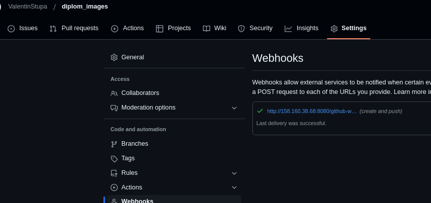
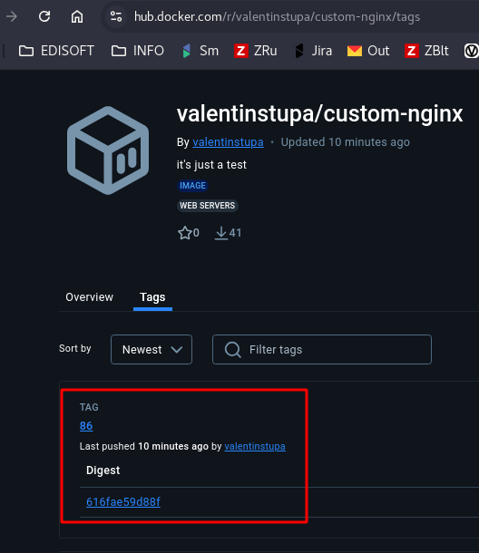
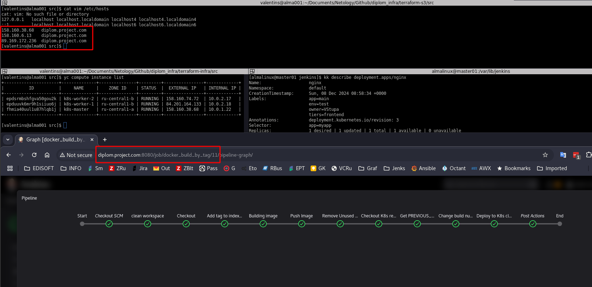
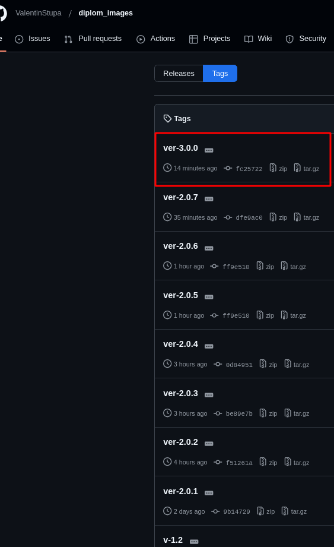
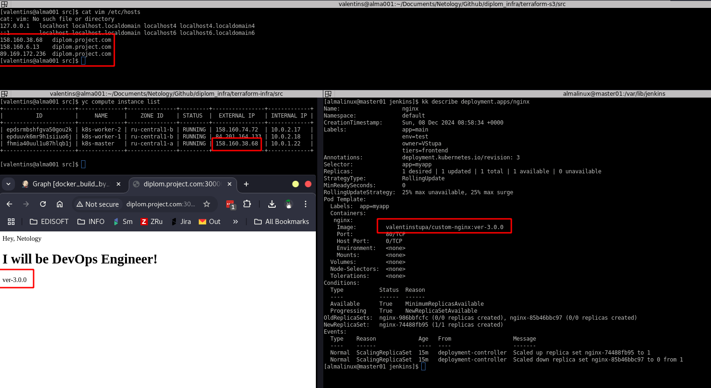

## Сборка образа и отправка в registry:
* [Jenkins file](./jenkinsfiles/docker_build.Jenkinsfile)
* [Pipeline log](./jenkinsfiles/pipeline-log_docker_buid#86.txt)
* Github Web-hook:
    
* Jenkins CICD:\
    
* DockerHub tag:\
    

## Сборка образа по тэгу. Отправка в registry. Deploy приложения в кластер K8s:
>[!NOTE]
> Процесс выполнялся в другой день. Из-за этого новый внешний ip адрес.

* [Jenkins file](./jenkinsfiles/myapp.Jenkinsfile)
* [Pipeline log](./jenkinsfiles/pipeline_log--docker_buildAndK8s_deploy#73.txt)
* Jenkins CiCd:\
    
* Repo tag:\
    
* Deploy new image to cluster k8s:\
    
### Mini how to
[Link to Image](https://hub.docker.com/r/valentinstupa/custom-nginx/tags)\
To run:\
``` docker pull valentinstupa/custom-nginx:1.0.0 ```\
``` docker run -p 8888:80 valentinstupa/custom-nginx:1.0.0 ```\
``` wget http://localhost:8888```

### Использовался локально установленный jenkins на master-node.